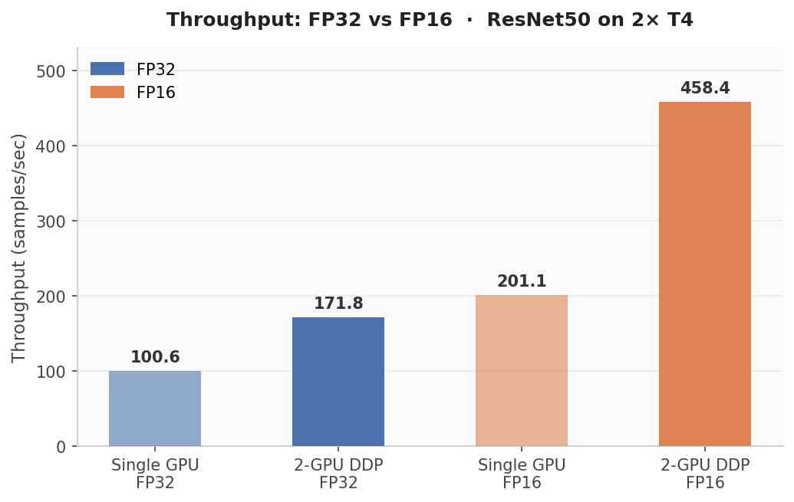
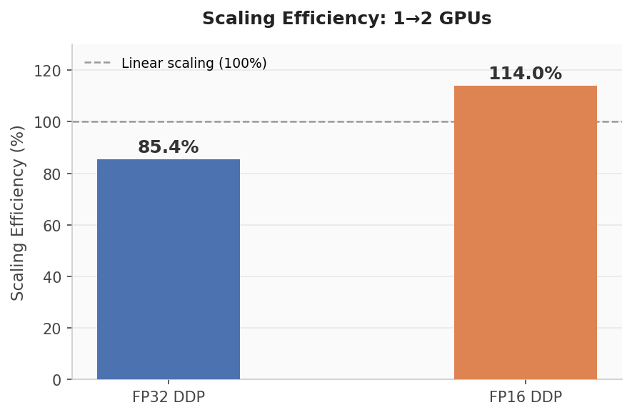
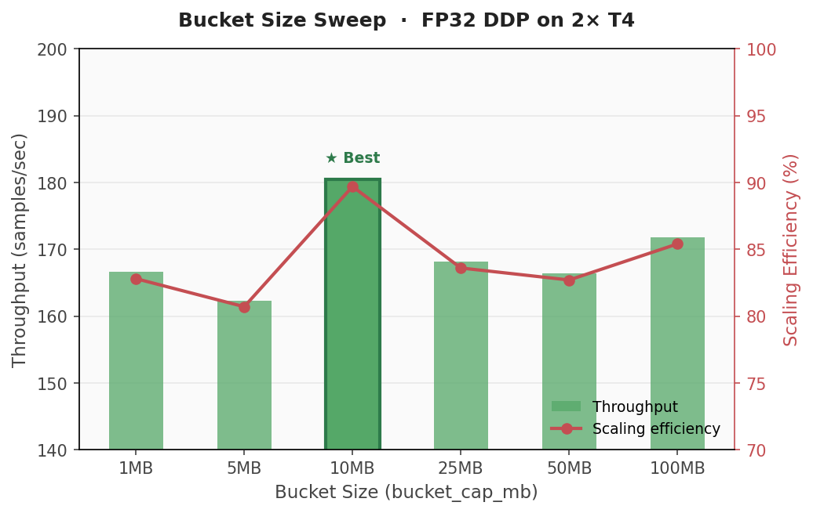

# DDP Scaling Efficiency Analysis

Systematic benchmarking of how ResNet50 training scales from 1 GPU to 2 GPUs
under PyTorch DistributedDataParallel (DDP), with PyTorch Profiler used to
isolate NCCL AllReduce communication overhead. Covers FP32 vs FP16 mixed
precision and a bucket size sweep to find the optimal `bucket_cap_mb`.

**Hardware:** 2× NVIDIA T4 (16GB each) · **Framework:** PyTorch 2.10 · **CUDA:** 12.8

---

## Results at a Glance

| Metric | FP32 | FP16 |
|---|---|---|
| Single-GPU throughput | 100.6 samples/sec | 201.1 samples/sec |
| 2-GPU DDP throughput | 171.8 samples/sec | 458.4 samples/sec |
| Scaling efficiency | 85.4% | 114.0% (superlinear) |
| Communication overhead | 14.6% | — |
| Optimal bucket size | 10MB (89.7% eff.) | — |

---

## Experiment 1 — FP32 vs FP16 Throughput



FP16 nearly doubles single-GPU throughput (100.6 → 201.1 samples/sec) due to
T4's Tensor Cores, which are optimized for FP16 matrix multiplication. The
2-GPU FP16 gain is proportionally even larger (+166.8% vs +99.9% for single GPU)
because the reduced gradient payload also cuts AllReduce communication volume in half.

---

## Experiment 2 — Scaling Efficiency



Scaling efficiency = `(ddp_throughput / world_size) / single_gpu_throughput`.
100% would mean perfectly linear scaling with zero overhead.

**Why FP32 lands at 85.4%, not 100%**

DDP overlaps gradient synchronization with backward computation using a bucket
mechanism: as each layer's gradient is ready, DDP groups gradients into 25MB
buckets and fires an NCCL AllReduce immediately, hiding latency behind the
still-running backward pass. The remaining 14.6% overhead is the unavoidable
tail — the last bucket has no more backward computation to hide behind.
`profile_ddp.py` isolates this by comparing NCCL CUDA time against total CUDA time.

**Why FP16 reaches 114% (superlinear scaling)**

Three effects compound:
1. **Tensor Core throughput** — FP16 compute is ~2× faster per GPU independently
2. **Halved AllReduce payload** — 2 bytes/param vs 4, so communication shrinks proportionally
3. **Cache effects** — smaller FP16 tensors increase L2 cache hit rate; this benefit
   is amplified in the 2-GPU run since each GPU handles a smaller working set

---

## Experiment 3 — Bucket Size Sweep



`bucket_cap_mb` controls how DDP batches gradients before triggering AllReduce.
Sweeping from 1MB to 100MB on this hardware/model combination:

| Bucket (MB) | Throughput | Scaling Efficiency |
|---|---|---|
| 1 | 166.6 | 82.8% |
| 5 | 162.3 | 80.7% |
| **10** | **180.5** | **89.7%** |
| 25 (default) | 168.2 | 83.6% |
| 50 | 166.4 | 82.7% |
| 100 | 171.8 | 85.4% |

10MB outperforms the PyTorch default of 25MB by 6.1 percentage points on T4.
The optimum reflects the interplay between PCIe transfer efficiency (T4 uses
PCIe, not NVLink) and ResNet50's layer-wise parameter distribution. The right
bucket size is hardware- and model-specific and should be tuned empirically.

---

## How DDP Keeps GPUs in Sync

```
Each training step:

1. Data sharding
   GPU0 ← first 64 images    GPU1 ← next 64 images

2. Independent forward + backward (parallel, no waiting)
   GPU0: loss0 → grad0        GPU1: loss1 → grad1

3. NCCL AllReduce (Ring algorithm)
   grad_avg = (grad0 + grad1) / 2   ← both GPUs receive identical result

4. Model update
   Both GPUs apply grad_avg → weights stay identical across replicas
```

`verify_allreduce.py` demonstrates this with a 4-element tensor: rank 0 starts
with `[1,2,3,4]`, rank 1 with `[5,6,7,8]`, and after AllReduce both hold `[3,4,5,6]`.

---

## Repo Structure

```
scripts/
  single_gpu_baseline.py   # 1-GPU FP32/FP16 throughput baseline
  ddp_benchmark.py         # 2-GPU DDP; configurable --fp16, --bucket_cap_mb
  verify_allreduce.py      # NCCL AllReduce correctness check
  profile_ddp.py           # PyTorch Profiler: communication overhead breakdown
  bucket_sweep.py          # Sweep bucket_cap_mb and report scaling efficiency
assets/
  throughput_comparison.png
  scaling_efficiency.png
  bucket_sweep.png
```

## Running

```bash
# 1-GPU baseline (FP32 and FP16)
python scripts/single_gpu_baseline.py

# 2-GPU DDP — FP32
torchrun --nproc_per_node=2 scripts/ddp_benchmark.py

# 2-GPU DDP — FP16
torchrun --nproc_per_node=2 scripts/ddp_benchmark.py --fp16

# AllReduce sanity check
torchrun --nproc_per_node=2 scripts/verify_allreduce.py

# Communication overhead profiling
torchrun --nproc_per_node=2 scripts/profile_ddp.py

# Bucket size sweep
torchrun --nproc_per_node=2 scripts/bucket_sweep.py
```

## Possible Follow-ups

- Extend to 4+ GPUs to see whether FP32 communication overhead grows with
  GPU count and whether FP16 superlinear scaling holds at larger world sizes.
- Gradient compression (top-k sparsification) to reduce AllReduce payload
  without the numerical tradeoffs of FP16.
- Repeat on NVLink-connected GPUs (e.g. A100×2) to quantify how
  interconnect bandwidth shifts the optimal bucket size.

---

## Project Architecture

```
experiment.ipynb          ← full experiment log with cell outputs
    │
    ▼
scripts/
  ├── single_gpu_baseline.py   ─→  FP32/FP16 baseline throughput
  ├── ddp_benchmark.py         ─→  FP32 DDP (85.4%) / FP16 DDP (114%)
  ├── verify_allreduce.py      ─→  NCCL AllReduce correctness check
  ├── profile_ddp.py           ─→  14.6% communication overhead
  └── bucket_sweep.py          ─→  optimal bucket = 10MB (89.7%)
    │
    ▼
assets/
  ├── throughput_comparison.png   ← FP32 vs FP16 bar chart
  ├── scaling_efficiency.png      ← 85.4% vs 114% comparison
  └── bucket_sweep.png            ← bucket size vs efficiency curve
    │
    ▼
README.md                 ← principles + charts + conclusions
```
